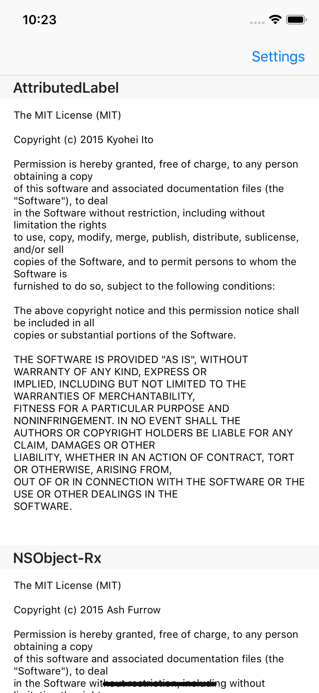
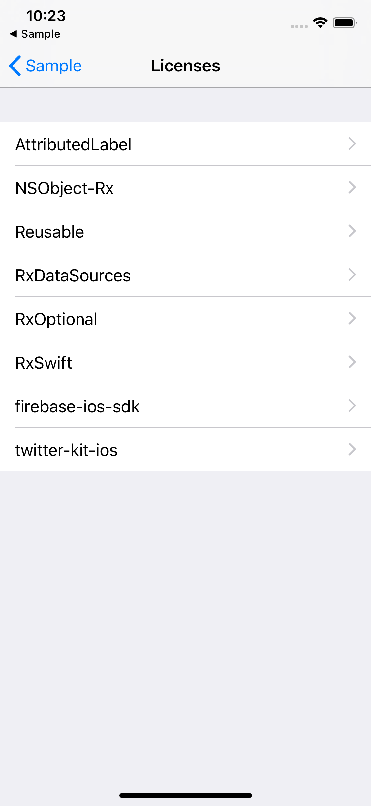
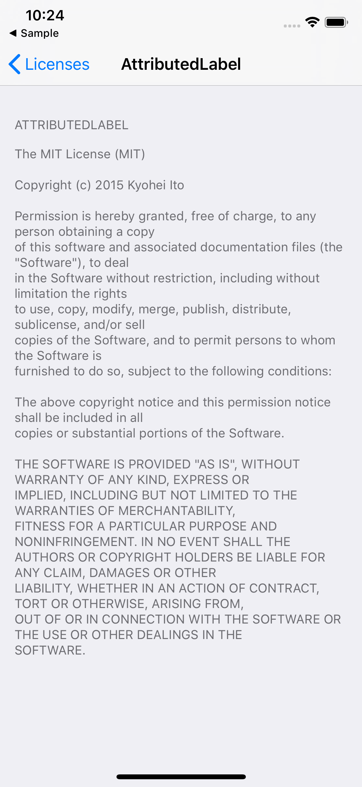

## What's AcknowledgementsPlist
`AcknowledgementsPlist` that combines licenses of `Carthage`, `CocoaPods`, and `Manual Plist` into `Bundle` and `Plist`.
- [Carthage](https://github.com/Carthage/Carthage)
- [CocoaPods](https://github.com/CocoaPods/CocoaPods)


[](https://img.shields.io/badge/Cocoapods-compatible-brightgreen.svg)
[](http://mit-license.org)

<table border="0">
<tr>
<td></td>
<td></td>
<td></td>
</tr>
</table>

## Requirements
- Xcode 10
- Swift 4.2

## How to install
#### CocoaPods
```Ruby
pod 'AcknowledgementsPlist'
```

#### Executable binary from [releases](https://github.com/cats-oss/AcknowledgementsPlist/releases)
Please use `exe binary` freely in each project!

## How to use AcknowledgementsPlist
### Usage
`./AcknowledgementsPlist project-root-path output-path options`

#### `project-root-path`
- Please specify the project root path as seen from the directory to be executed!

#### `output-path`
- Please specify the file name of `./~/foo.plist` and the bundle file name of `./~/bar.bundle` that starting from `project-root-path`!

### Options
#### `--pods-path`
- You can specify a `Pods` file path. The default is to search automatically.

#### `--carthage-checkouts-path`
- You can specify a `Checkouts` file path. The default is to search automatically.

#### `--manual-plist-path`
- You can add and include licenses manually to plist.
- The configuration of plist.↓
```
<?xml version="1.0" encoding="UTF-8"?>
<!DOCTYPE plist PUBLIC "-//Apple//DTD PLIST 1.0//EN" "http://www.apple.com/DTDs/PropertyList-1.0.dtd">
<plist version="1.0">
<dict>
	<key>PreferenceSpecifiers</key>
	<array>
		<dict>
			<key>FooterText</key>
			<string>Legal Text</string>
			<key>Title</key>
			<string>Library Name</string>
		</dict>
		<dict>
			<key>FooterText</key>
			<string>Legal Text</string>
			<key>Title</key>
			<string>Library Name</string>
		</dict>
	</array>
</dict>
</plist>
```

### Make Plist
1. Check if `Pods` and b `Carthage/Checkouts` exist.  
If `Carthage/Checkouts` does not exist, execute the command of `carthage checkout`.

2. Determine the location of the `AcknowledgementsPlist` and the output location of `Plist`.  
e.g. `./AcknowledgementsPlist ./../.. ./Sample/Resources/Sample-Acknowledgements.plist`

### Make Bundle
1.  Please do `1.` of [Make Plist](### Make Plist).

2. Make bundle and change `Root.plist` to the following configuration.
```
<?xml version="1.0" encoding="UTF-8"?>
<!DOCTYPE plist PUBLIC "-//Apple//DTD PLIST 1.0//EN" "http://www.apple.com/DTDs/PropertyList-1.0.dtd">
<plist version="1.0">
    <dict>
        <key>PreferenceSpecifiers</key>
        <array>
            <dict>
                <key>Type</key>
                <string>PSChildPaneSpecifier</string>
                <key>Title</key>
                <string>Licenses</string>
                <key>File</key>
                <string>AcknowledgementLinks</string>
            </dict>
        </array>
        <key>StringsTable</key>
        <string>Root</string>
    </dict>
</plist>
```

3. Determine the location of the `AcknowledgementsPlist` and the output location of `Bundle`.  
e.g. `./AcknowledgementsPlist ./../.. ./Sample/Resources/Settings.bundle`

## LICENSE
Under the MIT license. See [LICENSE](https://github.com/cats-oss/AcknowledgementsPlist/blob/master/LICENSE) file for details.
